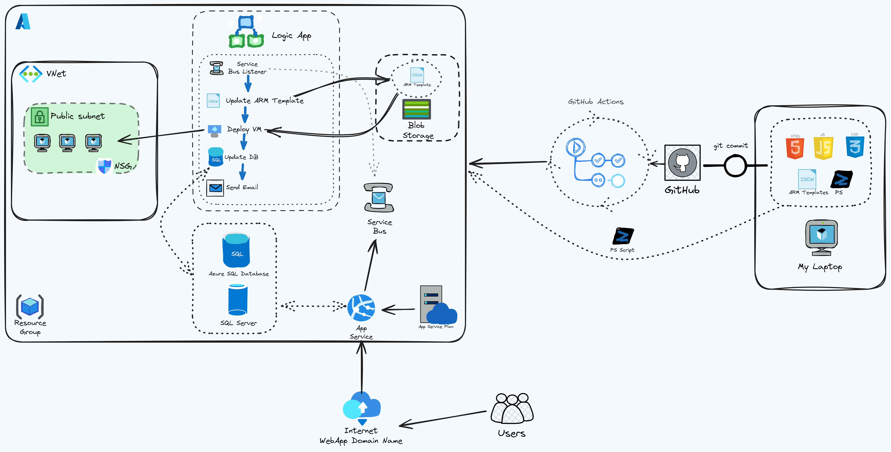

# Azure Windows VM Signup Project
This project enables users to sign up for an Azure Windows VM by providing their first name, last name, and email through a website form. 
The workflow involves several components deployed on Azure, including a Virtual Network, Network Security Group, Web App service, Azure SQL Database, Service Bus, Azure Logic App, Storage Account and ARM templates for VM deployment.

## Project Flow
1. User Signup for Windows Azure VM on Website
- Users enter their first name, last name, and email on a website form
- Clicking the signup button triggers the signup process
- The front end is deployed using Azure Web App Service to collect user information

2. JavaScript Functions
- Takes the entered user details (first name, last name, email)
- Creates a new entry in the Azure SQL Database if the user with provided email doesn't exist already
- Updates the SQL database with the new user information
- After updating the SQL database, a JavaScript function sends a message to the Service Bus message queue.

3. Azure Logic App Functionality
- Triggered upon receiving a message in the Service Bus queue
- Workflow:
  - Updates the ARM template saved in azure storage account blob for Azure VM Windows deployment based on received information
  - Creates a template deployment using the updated ARM template, provisioning an Azure Windows VM with configured shutdown which will be activated 24 hours after the deployment
  - Sends an email to the user containing RDP login credentials once the VM is provisioned successfully

## Infrastructure as Code (IaC)
- Leveraging ARM templates for deploying Azure resources
  - Virtual Network and Subnet
  - Network Security Group
  - Storage account
  - Azure SQL Database/Server
  - Service Bus
  - Web App
  - Logic App
  - Windows VM

## CI/CD
- Utilizing GitHub Actions for Continuous Integration (CI) and Continuous Deployment (CD) of the frontend and backend